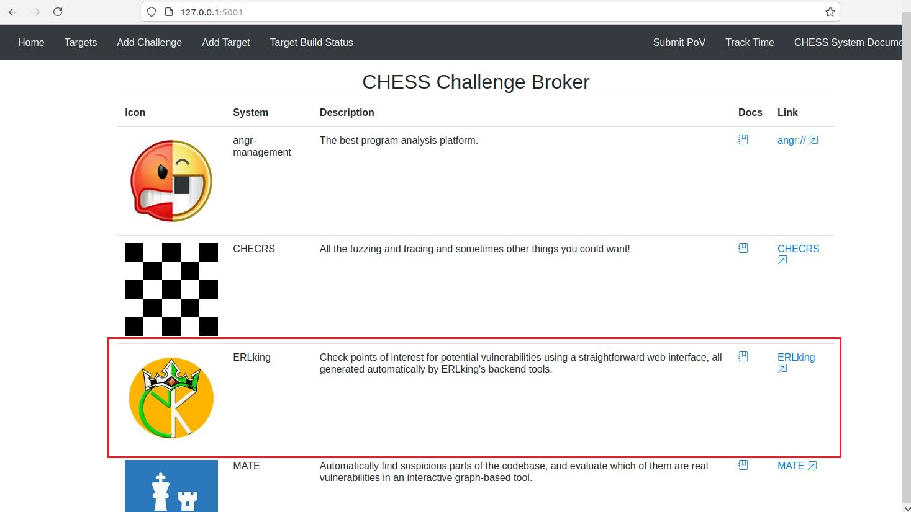
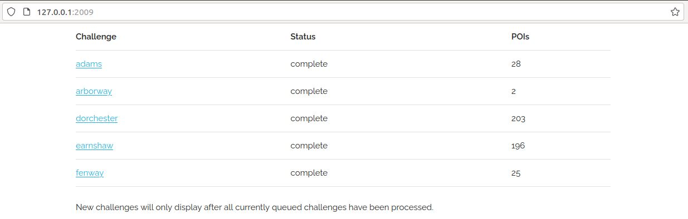
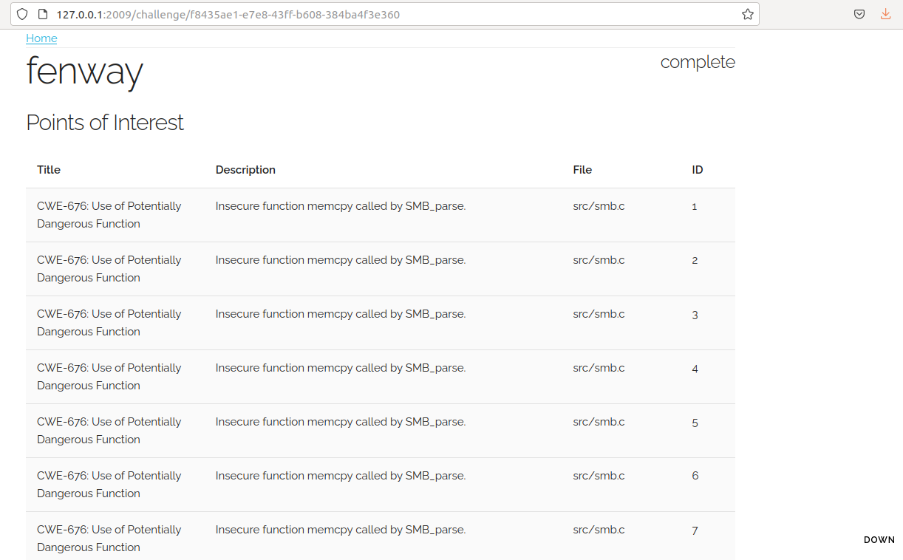
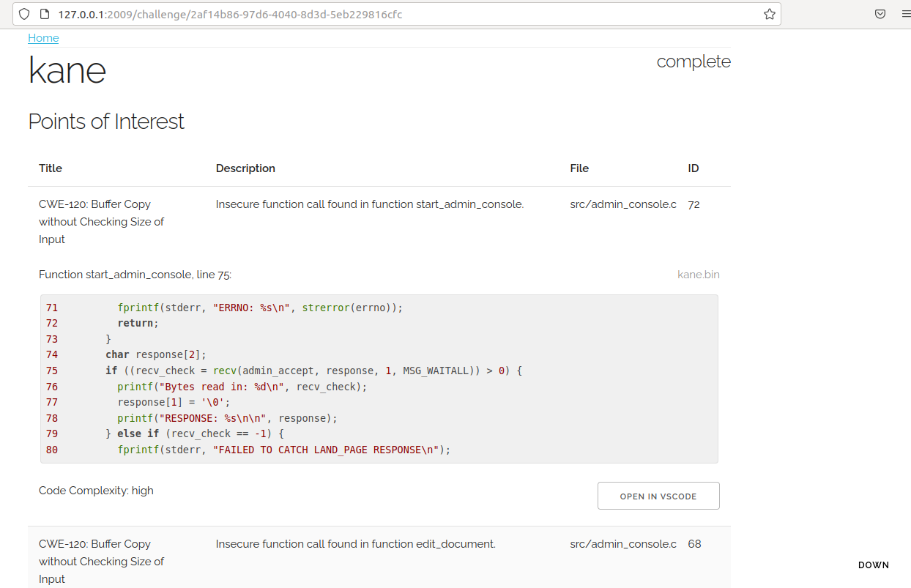
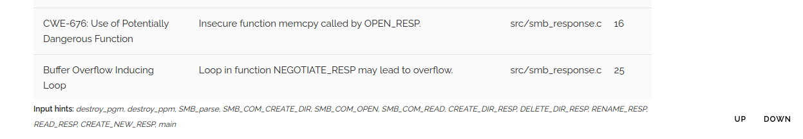

# ERLking Documentation

The **Erlking** web interface shows the POIs generated by Erlking. The POIs are sorted in descending order according to their vulnerability score.

We recommend accessing the UI with the Mozilla Firefox browser.

## 1. The landing page
 Erlking UI can be directly accessed through port 2009 or via the Chess system landing page at port 5001.

## 2. Erlking home page
 
Erlking automatically retrieves and analyzes challenges that have been submitted to the Chess challenge broker.
The home page displays the status of each submitted challenge. The final number of generated POIs is shown under the POI column after the status has changed to "complete".

The home page refreshes automatically every 5 minutes.  New challenges submitted to the challenge broker should show up within 3-5 minutes.

All potential status messages are shown below.

|Status          |Description                          |
|----------------|------------------------------|
|queued			|Challenge is retrieved and awaiting analysis           |
|error          |Error in analyzing the challenge            |
|complete       |Analysis is completed|
|restoring       |Challenge information is being restored after system restart |
|initializing       |Preparing challenge for analysis|
|analyzing source   |Generating Source CPG|
|analyzing binary	|Generating Binary CPG|
|generating POIs    |Finding POIs|
|not supported      |ERLking does not support this type of challenge |

A challenge will normally proceed through the following states: queued, initializing, analyzing source, analyzing binary, generating POIs, complete. 
If a challenge contains multiple target binaries, then the challenge will go through the "analyzing binary" and "generating POIs" states once per binary.  
All other states will occur only once per successfully analyzed challenge.  If there is an error, Erlking will automatically retry analyzing it up to three times.

Erlking can analyze multiple challenges at the same time.  The POI count will be updated as new POIs are found. 
Once a challenge's status changes to 'complete', no more POIs will be added to the POI list for that challenge.

## 3. Select a challenge
 
When a challenge is selected, the challenge page shows all the generated POIs for that challenge.
The first column shows the title of the POI. Usually, this includes the CWE class ID and class name.
The second column shows a description of the potential bug.
The third column shows the containing file name.
The final column shows the POI's ID, which is unique for that challenge.

The POIs are sorted according to descending order of their vulnerability score, which is not displayed. A higher vulnerability score means there is a higher chance of the POI being vulnerable.

Note: The bottom of the page contains potential external input sources listed as 'Input hints'. More information about this can be found under [General follow-up steps](#5-general-follow-up-steps).
	 

## 4. Expand a POI
 
 When a POI is selected, the expanded view provides more information about the POI and a link to view the corresponding source code.
 The expanded information includes the function name, line numbers, corresponding binary executable, code complexity, and a snippet of corresponding code.
 A link is provided to open the point-of-interest in the Visual Studio Code editor.
 
 Note: The angr management tool should have been installed and correctly configured to make the "OPEN IN VSCODE" feature available.

Code complexity can either be "high","moderate" or "low", which is an indication of how easy or difficult it will be to investigate that code. If not enough information can be found, then the code complexity will be displayed as "0".

## 5. General Follow-up steps
 
 Note: The POI list is already sorted according to its vulnerability score. Consider the code complexity level when you assign it to someone.
 
-   If the POI is complaining about a specific function, check if its arguments were properly sanitized.
	- The provided code snippets can be used for skimming.
	- Use "OPEN IN VSCODE" to explore it from VSCode.
	- If Erlking can't provide a snippet, or if the link to open the file in VSCode doesn't work, use your favourite IDE to look at the exact file location. 
-   Check if the given location is reachable by external inputs.
	- At the bottom of the page, we have provided few hints for potential external inputs. Check whether they can affect the given POI. As a shortcut, the user can use the scroll 'DOWN' button to go to the bottom of the page or the scroll 'UP' button to go to the top of the page. 
    - Check if the arguments of the specified function were affected by those external inputs (Sources). Some example external inputs include 'gets','read','recv','scanf', 'getenv', and 'main'.
    - If there is an affected variable, check if it can effect any external outputs (Sinks). Some example external outputs include 'system','write', and 'send'.

## 6. Analysis Types

The types of analysis that Erlking is interest at are as follows.

|Class/Type          |Description                          |
|----------------|------------------------------|
|EFFECTED_SINK |Sink effected by pointer|
|BOIL	| Buffer Overflow Inducing Loop|
|CWE-119| Improper Restriction of Operations within the Bounds of a Memory Buffer|
|CWE-120| Buffer Copy without Checking Size of Input|
|CWE-200| Exposure of Sensitive Information|
|CWE-676| Use of Potentially Dangerous Function|
|CWE-690| Unchecked Return Value to NULL Pointer Dereference|
